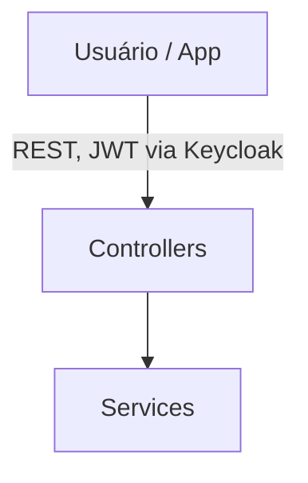
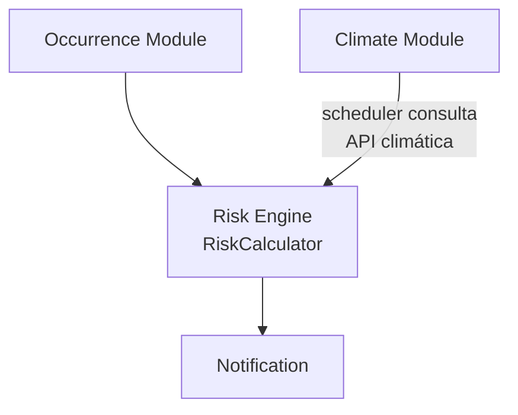
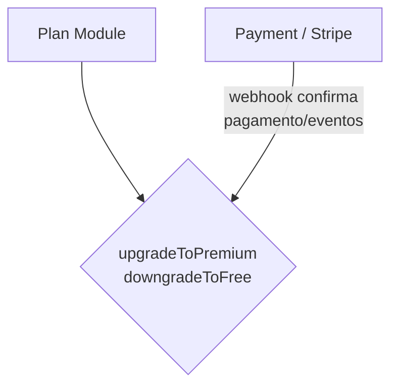

# Kairos

**Plataforma de monitoramento de risco ambiental** que correlaciona denúncias da comunidade com dados climáticos externos para gerar alertas automáticos de risco, disponível como demonstração aberta para qualquer pessoa testar.


> Projeto pessoal de portfólio, desenvolvido como exercício de arquitetura backend com Spring Boot 4 / Spring Framework 7, priorizando práticas de mercado: separação de camadas, testes automatizados, autenticação via OAuth2/Keycloak, mensageria assíncrona, integração de pagamento real (Stripe) e observabilidade básica.

🔗 **Aplicação em produção:** [kairos-alert.me](https://kairos-alert.me) · **API / Swagger:** [api.kairos-alert.me/swagger-ui/index.html](https://api.kairos-alert.me/swagger-ui/index.html)

---

## Índice

- [Visão geral](#visão-geral)
- [Arquitetura](#arquitetura)
- [Stack técnica](#stack-técnica)
- [Módulos do sistema](#módulos-do-sistema)
- [Assinaturas e pagamento (Stripe)](#assinaturas-e-pagamento-stripe)
- [Como rodar localmente](#como-rodar-localmente)
- [Deploy em produção](#deploy-em-produção)
- [Autenticação e como testar a API](#autenticação-e-como-testar-a-api)
- [Testes](#testes)
- [Decisões de design](#decisões-de-design)
- [Débitos técnicos e limitações conhecidas](#débitos-técnicos-e-limitações-conhecidas)
- [Roadmap](#roadmap)

---

## Visão geral

O sistema resolve um problema real: comunidades expostas a eventos climáticos extremos (enchentes, deslizamentos) precisam de um jeito rápido de reportar incidentes e receber alertas preventivos baseados em dados objetivos, não só na percepção individual de quem reporta.

O diferencial do projeto não é "mais um CRUD com clima", é o cruzamento de duas fontes de dados (denúncias da comunidade e dados climáticos de uma API externa) através de um motor de risco (`risk-engine`) que calcula um nível de risco ponderado e explicável, com um modelo de acesso por assinatura (trial, free ou premium) processado através de uma integração de pagamento real via Stripe, e uma interface web própria (React + Leaflet) para visualização em mapa e moderação.

## Arquitetura



Os `Services` se dividem em quatro módulos principais, cada um com seu próprio fluxo, detalhados abaixo em dois diagramas separados, já que risco e assinatura são fluxos independentes entre si.

**Fluxo de risco:**



**Fluxo de assinatura:**



**Fluxo principal (risco):**
1. Usuário autenticado registra uma ocorrência ambiental (enchente, deslizamento, etc.)
2. Um scheduler consulta periodicamente uma API climática externa (OpenMeteo) e publica um evento assíncrono (RabbitMQ)
3. Um consumer processa o evento, busca o clima, persiste os dados e publica outro evento para cálculo de risco
4. O `RiskCalculator` combina o risco climático (chuva/vento contra thresholds configuráveis) com o score agregado das ocorrências recentes da região, usando pesos configuráveis
5. O nível de risco resultante (`LOW` / `MEDIUM` / `HIGH` / `CRITICAL`) dispara, quando `HIGH`/`CRITICAL`, uma notificação assíncrona para um webhook do Discord

**Fluxo principal (assinatura):**
1. Usuário se cadastra e ganha automaticamente um plano `TRIAL` de 7 dias, criado no primeiro acesso autenticado, via filtro dedicado
2. Usuário solicita upgrade para `PREMIUM`: o backend cria uma Stripe Checkout Session e devolve a URL de pagamento (o valor cobrado nunca é definido pelo cliente, é resolvido no Stripe a partir de um Price ID fixo, configurado no backend)
3. Usuário completa o pagamento na página hospedada do Stripe
4. Stripe confirma via webhook assinado (HMAC) e o backend aplica o upgrade de fato
5. Renovações mensais, falhas de pagamento e cancelamentos são tratados de forma assíncrona pelos mesmos webhooks. Falhas pontuais não derrubam o acesso imediatamente, dá-se chance ao retry automático do Stripe; apenas o cancelamento efetivo rebaixa o plano

## Stack técnica

| Camada | Tecnologia |
|---|---|
| Linguagem / Runtime | Java 21 |
| Framework | Spring Boot 4.0.6 / Spring Framework 7 |
| Persistência | MySQL 8 (H2 em testes) + Flyway |
| Cache / Rate limiting | Redis + Bucket4j |
| Mensageria | RabbitMQ |
| Autenticação | Keycloak (OAuth2 / JWT) |
| Pagamento / assinaturas | Stripe (Checkout + Webhooks) |
| Documentação de API | springdoc-openapi (Swagger UI) |
| Containerização | Docker Compose |
| Proxy reverso / TLS | Nginx + Let's Encrypt (Certbot) |
| Testes | JUnit 5, Mockito, AssertJ, `@DataJpaTest`, `@WebMvcTest` |

## Módulos do sistema

Organização em **pacotes por domínio** (domain-first), não por camada técnica. Cada módulo carrega seu próprio controller, service, repository e DTOs:

```
br.com.artheus.kairos
├── occurrence → denúncias ambientais (CRUD, verificação, resolução, mapa)
├── climate → integração com API externa de clima
├── risk → RiskCalculator (motor de cálculo de risco) + orquestração + mensageria
├── plan → planos de assinatura (trial/free/premium), ciclo de vida via webhooks
├── payment → integração Stripe (checkout, parsing de eventos de webhook)
├── cities → cidades monitoradas, geocoding externo (Open-Meteo), resumo climático
├── notification → disparo de alertas via Discord webhook (canal único, reutilizável)
├── anonymization → pseudonimização reversível de denunciantes (UserReference), para exibição anônima em contexto de moderação
└── shared
├── contract → DTOs e interfaces cruzando módulos (Dependency Inversion)
├── enums
├── exception
├── config
├── security
└── filter → FirstAccessProvisioningFilter (provisionamento de primeiro acesso: plano + user reference)
```

O `shared/contract` existe especificamente para permitir que módulos se comuniquem via interfaces, sem depender diretamente da implementação uns dos outros. Por exemplo, `risk` consome um `ClimateInput` e uma lista de `OccurrenceSummary` sem conhecer `ClimateService` ou `OccurrenceService` diretamente; `plan` dispara notificações através de `NotificationSender` sem saber que a implementação real é um webhook do Discord.

### `occurrence`

- CRUD completo de ocorrências ambientais, com referência a imagem via URL externa, categoria, severidade e geolocalização (não há upload/armazenamento de arquivo binário pelo backend)
- **Controle de acesso refinado**: usuários comuns só editam/removem suas próprias ocorrências; ADMIN tem bypass de ownership, mas **não** bypassa regras de estado (uma ocorrência finalizada continua bloqueada mesmo para ADMIN)
- Distinção explícita entre `ForbiddenException` (403, falha de autorização) e `BusinessException` (422, violação de regra de negócio)
- Endpoints `POST /{id}/verify` e `POST /{id}/resolve`, restritos a ADMIN, com defesa em profundidade (bloqueio tanto no `SecurityConfig` quanto na camada de service)
- `PATCH /{id}` aceita atualização parcial de título, descrição e localização (`latitude`/`longitude`). A mesma entidade se protege contra alteração em ocorrências já finalizadas ou removidas, e cada campo só é alterado se enviado (omitir um campo não o apaga)
- Endpoint dedicado e leve (`GET /occurrences/map`) para alimentar a visualização em mapa do frontend, retornando apenas coordenadas, categoria, severidade e status via projeção direta no banco (sem carregar a entidade completa nem suas relações), com a lista de status permitidos resolvida a partir da role do usuário autenticado dentro da própria query, nunca filtrada em memória depois de buscada
- Cada `OccurrenceResponse` carrega um objeto `OccurrenceActions` (`canEdit`, `canDelete`, `canVerify`, `canResolve`) pré-calculado pelo backend. O frontend não precisa duplicar lógica de permissão, só ler o resultado
- Na visão de moderação do admin (`GET /occurrences`), cada ocorrência também carrega um `reporterDisplayId` anônimo (ex: `#12345`) no lugar do UUID do denunciante. Ver `anonymization` e "Decisões de design"

### `risk`, o motor de decisão

- `RiskCalculator`: classe pura (sem I/O, sem dependência de framework), combinando score climático (chuva/vento contra thresholds configuráveis, condição OR) e score de ocorrências (peso por categoria × severidade, normalizado com teto), com pesos validados para somar exatamente `1.0`
- `RiskService`: orquestra o cálculo, persiste o resultado e dispara notificação (apenas para `HIGH`/`CRITICAL`). A sequência de operações é garantida via teste com `InOrder`, provando que o risco é sempre persistido antes de qualquer tentativa de notificação
- `RiskConsumer`/`RiskProducer`: entrada e saída assíncrona via RabbitMQ, com roteamento de falhas para Dead Letter Queue baseado no tipo de exceção (falha permanente vs. transitória)

### `climate`

- `ClimateDataSummary`: valida faixas fisicamente plausíveis (temperatura, chuva, vento, umidade) diretamente no construtor compacto do record, rejeitando dados corrompidos vindos da API externa antes que cheguem ao motor de risco
- `ClimateService`/`ClimateConsumer`: busca dados na Open-Meteo, persiste, publica evento de cálculo de risco. Falhas de integração externa são traduzidas para `ExternalServiceException`, isolando o cliente HTTP de quem consome o resultado

### `plan`, assinaturas e ciclo de vida

- Três estados: `TRIAL` (7 dias, criado automaticamente no primeiro acesso), `FREE`, `PREMIUM` (mensal, via Stripe)
- Provisionamento do plano no primeiro acesso é feito via `FirstAccessProvisioningFilter` (`shared/filter`), um filtro compartilhado que também provisiona a `UserReference` do usuário (ver `anonymization`) no mesmo momento, evitando duplicar o mecanismo de "primeira requisição autenticada, com cache" para cada nova entidade que precisar desse padrão
- Cache em Redis (TTL configurável) evita consulta redundante ao banco a cada requisição
- Scheduler (`checkExpiredPlans`) rebaixa apenas planos `TRIAL` expirados. Um plano `PREMIUM` **nunca** é rebaixado por expiração de data local, só é rebaixado reativamente, via webhook de cancelamento do Stripe (evita cortar acesso de um cliente pagante por atraso ou falha de um webhook de renovação)
- Constraint `UNIQUE` em `plans.user_id` no banco. A criação concorrente do plano inicial (duas requisições simultâneas no primeiro acesso) é tratada isolando a escrita em uma transação própria (`REQUIRES_NEW`), evitando que a race condition, esperada e recuperável, derrube a transação inteira da requisição com um `UnexpectedRollbackException`

### `payment`, integração Stripe

- `StripeCheckoutService`: cria a Checkout Session (modo assinatura), referenciando um Price ID fixo configurado no backend. O valor cobrado nunca é definido pelo cliente
- `StripeEventParser`: deserializa e roteia eventos de webhook (com fallback de deserialização segura para insegura, para lidar com incompatibilidades de versão da API do Stripe), delegando para o processamento de domínio
- `StripeWebhookController`: valida a assinatura HMAC do Stripe (`Stripe-Signature`) e roteia por tipo de evento. Não usa autenticação JWT, sua segurança vem inteiramente da verificação de assinatura
- Eventos tratados: `checkout.session.completed` (ativação), `invoice.paid` (renovação/reativação), `invoice.payment_failed` (aviso, sem downgrade, dá-se chance ao retry automático do Stripe), `customer.subscription.deleted` (cancelamento efetivo, único evento que rebaixa o plano)

### `cities`

- `MonitoredCityService`: geocoding via Open-Meteo, limite de cidades monitoradas por plano, evita duplicidade de cidade no banco (reaproveita registro existente antes de criar um novo)
- `UserCity` mapeado com `@ManyToOne` real para `City` (JPA), refletindo a FK que já existia no schema
- `GET /monitored-cities/climate` retorna as cidades monitoradas ativas do usuário já enriquecidas com o resumo climático mais recente de cada uma, evitando que o frontend precise fazer uma chamada por cidade. Cidades sem dado climático coletado ainda (ex: recém-adicionadas, scheduler não rodou o primeiro ciclo) retornam com o campo de clima nulo, sem falhar a resposta inteira

### `notification`

- `NotificationSender`: interface genérica (`sendNotification(String message)`), desacoplada de qualquer caso de uso específico, reutilizada tanto para alertas de risco (`RiskService`) quanto para eventos de billing (`BillingNotificationService`)
- Única implementação hoje: `DiscordWebhookNotificationSender`, mandando para um canal fixo. Outras implementações (e-mail, WhatsApp) podem ser adicionadas futuramente atrás da mesma interface, sem alterar quem a consome

### `anonymization`

- `UserReference`: tabela local mínima (`keycloakUserId` + `id` autoincrement + `createdAt`), mapeando usuários do Keycloak para um identificador sequencial, sem duplicar nenhum dado de identidade (nome, e-mail, senha continuam só no Keycloak), só uma referência
- Populada sob demanda via `FirstAccessProvisioningFilter`, no mesmo momento em que o plano é provisionado. Nenhum job de sincronização em lote, nenhuma pré-população
- `ensureUserReferenceExists` trata a condição de corrida de duas requisições concorrentes tentando criar a referência do mesmo usuário simultaneamente, isolando a escrita em uma transação própria (`REQUIRES_NEW`). A constraint `UNIQUE` em `keycloak_user_id` garante a integridade; o catch só evita que a segunda requisição quebre
- `getDisplayId(userId)` expõe o identificador formatado (`#12345`), usado hoje como `reporterDisplayId` na visão de moderação do admin. Ver "Decisões de design" para o raciocínio completo por trás dessa escolha

## Assinaturas e pagamento (Stripe)

O upgrade de plano não é mais um placeholder, é uma integração real testada tanto em sandbox quanto em produção (Stripe test mode), incluindo o ciclo de vida completo da assinatura:

| Evento Stripe | Efeito no sistema |
|---|---|
| `checkout.session.completed` | Ativa o plano PREMIUM, persiste `stripeCustomerId`/`stripeSubscriptionId` |
| `invoice.paid` | Confirma renovação (sem mudança de estado se já PREMIUM) ou reativa o plano se havia sido rebaixado |
| `invoice.payment_failed` | Loga e notifica (canal operacional), **não** rebaixa. Falhas de cobrança costumam ser transitórias e o Stripe já tenta novamente automaticamente |
| `customer.subscription.deleted` | Rebaixa para FREE, limpa `stripeSubscriptionId` (mantém `stripeCustomerId` para eventual reassinatura futura) |

Testado de ponta a ponta tanto localmente (Stripe CLI, `stripe listen` + `stripe trigger`) quanto em produção (endpoint de webhook real registrado no Dashboard do Stripe, validado com assinatura HMAC via HTTPS), confirmando persistência correta no banco em cada cenário.

## Como rodar localmente

Pré-requisitos: Docker + Docker Compose, JDK 21, Maven. Para testar o fluxo de pagamento, uma conta de teste no [Stripe](https://dashboard.stripe.com/register) (gratuita) e o [Stripe CLI](https://docs.stripe.com/stripe-cli).

```bash
# 1. Clone o repositório
git clone https://github.com/arthsdev/kairos.git
cd kairos

# 2. Copie o arquivo de variáveis de ambiente de exemplo
cp .env.example .env

# 3. Suba toda a infraestrutura (MySQL, Redis, RabbitMQ, Keycloak)
docker compose up -d

# 4. Rode a aplicação
mvn spring-boot:run
```

O `.env.example` já vem com valores de desenvolvimento prontos (incluindo usuários e client secrets do Keycloak pré-configurados via realm export versionado). Não é necessário nenhum ajuste manual para rodar a aplicação e a suíte de testes.

> As variáveis `KC_PROXY_MODE`, `KC_PROXY_HEADERS_MODE`, `KC_HOSTNAME_STRICT_HTTPS` e `KC_HOSTNAME_PORT` controlam como o Keycloak se comporta atrás de um proxy reverso. Localmente, ficam desativadas (`none`/`false`/`8080`), já que não há proxy no caminho. Ao subir a aplicação em produção atrás de um proxy reverso com TLS (ver [`docs/deployment-notes.md`](docs/deployment-notes.md)), basta garantir que o `.env` daquele ambiente use `KC_PROXY_HEADERS_MODE=xforwarded` (e os demais valores de proxy correspondentes) para que o Keycloak gere URLs e tokens corretos.

Para testar o fluxo de pagamento real, é necessário preencher as próprias credenciais de teste do Stripe (`STRIPE_SECRET_KEY`, `STRIPE_PREMIUM_PRICE_ID`) e rodar `stripe listen --forward-to localhost:8081/api/v1/webhooks/stripe` para receber webhooks localmente. Sem isso, o restante do sistema funciona normalmente.

A API sobe em `http://localhost:8081`. O Swagger UI fica disponível em `http://localhost:8081/swagger-ui/index.html`.

> O frontend (React + Leaflet) que consome esta API vive em um repositório separado: [kairos-frontend](https://github.com/arthsdev/kairos-frontend).

O `.env.example` já vem com valores de desenvolvimento prontos (incluindo usuários e client secrets do Keycloak pré-configurados via realm export versionado). Não é necessário nenhum ajuste manual para rodar a aplicação e a suíte de testes.

Para testar o fluxo de pagamento real, é necessário preencher as próprias credenciais de teste do Stripe (`STRIPE_SECRET_KEY`, `STRIPE_PREMIUM_PRICE_ID`) e rodar `stripe listen --forward-to localhost:8081/api/v1/webhooks/stripe` para receber webhooks localmente. Sem isso, o restante do sistema funciona normalmente.

A API sobe em `http://localhost:8081`. O Swagger UI fica disponível em `http://localhost:8081/swagger-ui/index.html`.

> O frontend (React + Leaflet) que consome esta API vive em um repositório separado: [kairos-frontend](https://github.com/arthsdev/kairos-frontend).

## Deploy em produção

A aplicação está implantada em uma instância AWS EC2, com domínio próprio, HTTPS real (Let's Encrypt) e Nginx como proxy reverso, separando frontend, API e Keycloak em subdomínios:

| Domínio | Serve |
|---|---|
| [kairos-alert.me](https://kairos-alert.me) | Frontend (Vercel) |
| [api.kairos-alert.me](https://api.kairos-alert.me) | Backend / API |
| [auth.kairos-alert.me](https://auth.kairos-alert.me) | Keycloak |

O processo de deploy, incluindo os desafios reais enfrentados (hairpin NAT em containers Docker na AWS, decoupling entre URL interna e URL pública do Keycloak, e uma interação não documentada entre `KC_HOSTNAME_PORT` e o carregamento do Admin Console), está documentado em detalhe em [`docs/deployment-notes.md`](docs/deployment-notes.md), incluindo o raciocínio por trás de cada correção, não só o resultado final.

## Autenticação e como testar a API

O sistema usa Keycloak como Authorization Server (OAuth2 / JWT), mas o frontend/cliente nunca fala diretamente com o Keycloak. O backend expõe um proxy fino, mantendo o `client_secret` sempre do lado do servidor:

```bash
# Registro de novo usuário
curl -X POST http://localhost:8081/api/v1/auth/register \
  -H "Content-Type: application/json" \
  -d '{
    "username": "novousuario",
    "email": "novo@kairos.com",
    "password": "SenhaForte123!",
    "firstName": "Novo",
    "lastName": "Usuario"
  }'

# Login (usuários admin e test02 já vêm pré-cadastrados no realm importado)
curl -X POST http://localhost:8081/api/v1/auth/login \
  -H "Content-Type: application/json" \
  -d '{ "username": "test02", "password": "<senha do usuário>" }'

# Renovação de sessão (access token expira em 5 minutos)
curl -X POST http://localhost:8081/api/v1/auth/refresh \
  -H "Content-Type: application/json" \
  -d '{ "refreshToken": "<refresh_token retornado no login>" }'
```

Use o `accessToken` retornado no header `Authorization: Bearer <token>` das requisições subsequentes (via Insomnia, Postman ou pelo próprio Swagger UI, que possui suporte a autorização OAuth2 embutido).

### Por que dois clients Keycloak

- **`kairos-api`**: autentica usuários finais (`login`/`refresh`), sem privilégio administrativo
- **`kairos-admin-service`**: usado exclusivamente pelo endpoint de `register`, com a role `manage-users` (não admin total do realm), seguindo o princípio de menor privilégio. Se o secret de um vazar, o outro fluxo continua protegido

### Nota de segurança sobre os secrets versionados

Os secrets dos dois clients (`kairos-local-dev-secret` e `kairos-admin-service-local-dev-only-secret`) são valores triviais, versionados de propósito no realm export (`keycloak/kairos-realm.json`), para permitir `git clone && docker compose up` sem nenhum ajuste manual.

Isso é seguro **apenas** porque o Keycloak roda localmente e não é exposto publicamente neste setup de desenvolvimento. Em produção, esses secrets são regenerados e mantidos apenas em uma cópia local não versionada do arquivo de realm, nunca commitados de volta ao repositório. Ver [`docs/deployment-notes.md`](docs/deployment-notes.md) para o processo completo.

## Testes

```bash
mvn test
```

A suíte inteira roda **sem necessidade de infraestrutura real** (Docker não precisa estar de pé). Todas as dependências externas (Keycloak, banco de dados, RabbitMQ, Redis, Discord webhook, Stripe) são mockadas ou substituídas por implementações em memória no profile `test`:

- Banco de dados: H2 em memória, no lugar do MySQL
- Redis (usado para rate limiting distribuído via Bucket4j): substituído por um `ProxyManager` mockado, ativo apenas sob o profile `test`
- Keycloak, RabbitMQ, webhook, Stripe: configurações com valores dummy via `application-test.yml`

Cobertura por módulo. Todos os módulos possuem testes automatizados cobrindo entidade/domínio, service (com mocks), controller (`@WebMvcTest`, quando aplicável) e, no caso de `occurrence`, também repositório (`@DataJpaTest` com H2 real):

`occurrence` (incluindo o endpoint de mapa, com autorização por role testada em três camadas: unit, `@DataJpaTest` e `@WebMvcTest`) · `risk` (calculator, properties, service, consumer, producer) · `climate` (validação, service, consumer, producer) · `plan` (entidade, service, provisionamento em transação isolada) · `anonymization` (entidade, service, provisionamento em transação isolada) · `payment` (checkout service, parser de eventos, controller de webhook) · `cities` (geocoding, limite de plano, resumo climático em lote) · `notification` (sender) · segurança (`KeycloakRoleConverter`, `FirstAccessProvisioningFilter`)

## Decisões de design

- **`ForbiddenException` (403) vs. `BusinessException` (422)**: autorização (quem pode fazer) é uma preocupação diferente de regra de negócio (o que é válido fazer neste estado). Misturar os dois em uma exceção genérica dificulta tanto o cliente da API quanto a manutenção do código.
- **Defesa em profundidade**: endpoints administrativos são bloqueados tanto no `SecurityConfig` (nível de rota) quanto na camada de `service` (nível de regra de negócio). A entidade `Plan` também se protege sozinha contra upgrade duplicado, não confiando inteiramente na disciplina de quem chama.
- **Validação na fronteira de entrada de dados externos**: dados vindos de APIs externas (clima) são validados no ponto exato em que se tornam objetos de domínio. Não se confia que uma API de terceiros sempre retornará dados sãos.
- **Segurança de pagamento por design, não por confiança**: o valor cobrado nunca é enviado pelo cliente (é resolvido a partir de um Price ID fixo do lado do Stripe). A confirmação de pagamento só é aceita via webhook com assinatura HMAC verificada, nunca por retorno síncrono do frontend.
- **Falha transitória vs. falha permanente no ciclo de billing**: uma falha de cobrança em renovação não derruba o acesso do usuário imediatamente. O Stripe tenta novamente automaticamente por alguns dias, e só o cancelamento efetivo (evento distinto) rebaixa o plano. Evita punir usuários por problemas pontuais de meio de pagamento.
- **Isolamento transacional em provisionamento sob concorrência**: capturar uma exceção de violação de constraint dentro de um método `@Transactional` não evita que a transação inteira seja marcada como rollback-only pelo Spring. Mesmo tratando o erro graciosamente, o commit final falharia. `Plan` e `UserReference` isolam a escrita concorrente em um componente próprio com `@Transactional(propagation = REQUIRES_NEW)`, garantindo que uma tentativa perdida na corrida não contamine a transação da requisição inteira.
- **Extração de responsabilidades quando uma classe cresce demais**: tanto `RiskConsumer`/`ClimateConsumer` (casca fina delegando para services) quanto `StripeWebhookController`/`StripeEventParser` (controller só valida e roteia; parser sabe deserializar e extrair dados) seguem o mesmo princípio: um componente por responsabilidade, mesmo que isso signifique mais uma classe pequena.
- **`switch` exaustivo sobre enums, sem `default` silencioso**: preferido a um `default` genérico, para que a adição futura de um novo valor ao enum gere erro de compilação em vez de comportamento silenciosamente incorreto.
- **`NotificationSender` genérico, sem `recipient` especulativo**: a interface expõe só `sendNotification(String message)`. Um parâmetro de destinatário foi deliberadamente omitido até que exista um canal real que precise dele (a única implementação hoje, Discord, usa um canal fixo sem discriminação por pessoa).
- **YAGNI aplicado a testes**: métodos gerados automaticamente pelo compilador (`equals`/`hashCode`/`toString` de records) não são testados. São responsabilidade da linguagem, não do domínio.
- **`FirstAccessProvisioningFilter` generalizado em vez de um filtro por entidade**: quando surgiu a necessidade de provisionar uma segunda entidade (`UserReference`) no primeiro acesso, além do `Plan` já existente, o filtro original (`PlanFirstAccessFilter`) foi generalizado em vez de duplicado. Um segundo filtro faria a mesma dança técnica (checar cache, criar se ausente) para outro domínio, duplicando mecanismo em vez de lógica de negócio. Uma interface genérica de "provisionador" foi cogitada e descartada por generalização prematura: com apenas dois casos concretos e nenhum terceiro previsto, o custo da abstração não se paga.
- **Anonimização reversível do denunciante (`reporterDisplayId`)**: ocorrências mostram um identificador anônimo (`#12345`, derivado do ID sequencial de uma tabela local de referência) em vez do UUID do Keycloak, reduzindo viés de moderação e exposição desnecessária de identidade. Um hash determinístico sem persistência foi cogitado primeiro, mas descartado: sem uma tabela de mapeamento, não haveria como reverter o identificador de volta ao usuário real em caso de necessidade legítima (investigação de abuso, ordem judicial), o mesmo problema de exposição indevida, só que na direção oposta. O campo só é populado na visão de moderação do admin. Na resposta ao próprio criador da ocorrência, permanece `null`, o que também evita que o usuário conheça seu próprio identificador anônimo (benefício incidental: sem esse número, não há como inferir metadados do sistema, como contagem aproximada de usuários, a partir da própria conta).
- **Endpoints leves e específicos por consumidor, não um único DTO "rico" reaproveitado em tudo**: o mapa de ocorrências (`GET /occurrences/map`) e o resumo climático em lote (`GET /monitored-cities/climate`) existem como endpoints próprios, separados da listagem paginada completa. Cada um retorna apenas o que a tela que o consome de fato precisa, em vez de forçar todo cliente a pagar o custo de um payload rico que só um caso de uso específico usa.

## Débitos técnicos e limitações conhecidas

- Sem Circuit Breaker nas integrações externas (Resilience4j ainda imaturo na versão atual do Spring Boot usada)
- Sem monitoramento/reprocessamento de Dead Letter Queue no RabbitMQ
- Notificações de billing (falha de pagamento, cancelamento) hoje vão para o mesmo canal Discord operacional dos alertas de risco. Não chegam ao usuário final diretamente. Um canal pessoal de verdade (e-mail via SMTP) exigiria uma nova implementação de `NotificationSender`
- `FirstAccessProvisioningFilter`: o cache Redis pode dessincronizar da fonte de verdade (MySQL) em cenários raros de reset independente dos dois armazenamentos. O tratamento de erro do filtro também não possui métrica/alerta, apenas log
- Sem testes automatizados para o cliente/scheduler de integração com a API climática externa (parsing da resposta do Open-Meteo em si)
- `GET /occurrences` (listagem administrativa paginada) ainda não tem paginação exposta de fato no frontend. O cliente hoje busca um lote fixo (`size=100`), suficiente para o volume atual de dados de demonstração, mas não para escala de produção
- O motor de risco (`RiskCalculator`) calcula um `RiskLevel` por evento, mas não persiste esse resultado de forma consultável por região. Ele dispara o alerta e o valor calculado não fica disponível para, por exemplo, um mapa de calor de risco agregado
- Backup do banco de dados em produção é local à instância (dump diário via cron, retenção de 7 dias). Não há cópia externa (S3 ou similar); protege contra corrupção/erro humano, não contra perda da instância inteira
- Infraestrutura de produção roda em uma única instância EC2, sem redundância. MySQL, Redis, RabbitMQ, Keycloak e backend compartilham o mesmo host

## Roadmap

- [x] Frontend (React + Leaflet para visualização em mapa) - [kairos-frontend](https://github.com/arthsdev/kairos-frontend)
- [x] Deploy em produção (AWS EC2 + Nginx + Let's Encrypt, domínio próprio) - [kairos-alert.me](https://kairos-alert.me)
- [ ] Notificação de billing por e-mail (SMTP), não só canal operacional
- [ ] Observabilidade (Prometheus/Grafana) para filas de processamento e schedulers
- [ ] Persistência consultável do resultado do risk engine por região, viabilizando um mapa de calor de risco agregado
- [ ] Backup externo (S3) do banco de dados de produção

---

**Autor:** Artheus — [github.com/arthsdev](https://github.com/arthsdev)